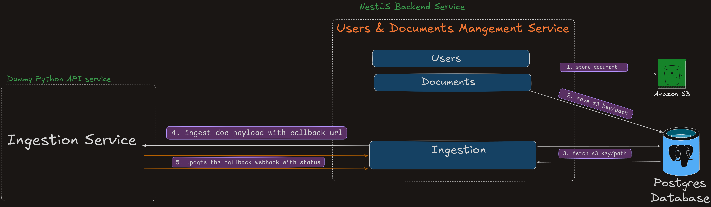
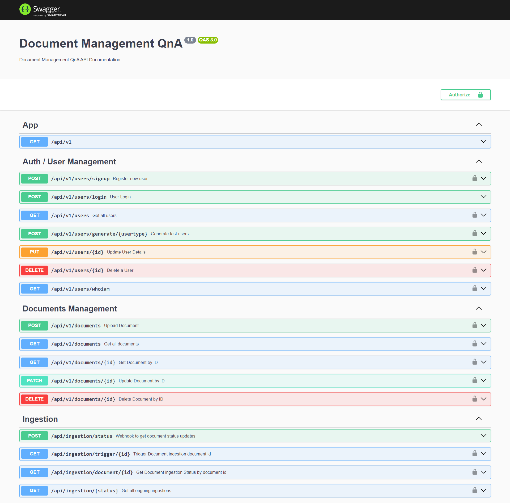

# Document Management QnA - [Project Dashboard](https://github.com/users/abhijeetsatpute/projects/13)

This repository contains a NestJS Backend service for Document Management and RAG-based Q&A Application with Users Management, Document Management And Ingestion Webhook and Ingestion Trigger APIs which ingests the documents stroed in s3 to a dummy Python Backend.

## Technologies

- **Backend**: [NestJS](https://nestjs.com/)
- **Database**: PostgreSQL with Sequelize ORM with migrations & seeder files for Database schema version control following the Database first approach.
- **Authentication & Authorization**: JWT (JSON Web Tokens) for verifying user's idenetity & user roles for RBAC protected API's
- **File Storage**: AWS Sdk wrapper for S3 file storage, retrival & deletion
- **Husky pre-commit hook**: pre-commit hook runs the unit test suite making sure no broken code is commited

## Project Structure

```
dma-system/ 
    ├── document_processor/ # Dummy Python flask api
    |
    ├── src/ 
    |    │ 
    |    ├── users # Users module with CRUD
    |    │ 
    |    ├── documents # Docs module with CRUD
    |    │ 
    |    └── ingestion # Ingestion module with Webhook/Trigger
    |
    ├── .env # Environment variable 
    ├── package.json # Root package configuration 
    └── README.md # Project documentation
```

## High-Level Design

### Database Schema Design
[Find here](https://dbdiagram.io/d/DMA-67c55773263d6cf9a0006614)


Below is the **Low-Level Design** of the system, illustrating how the document storage & document ingestion works on the low-level with the external python service.

[Find here](https://excalidraw.com/#json=YREijOBMbBUpsOjxpl1qo,5NV6v74HUKoXODuBm_SfoQ)


> *Dummy Python API service* is hosted under dir: ./document_processor

## Local Installation

### Prerequisites

- **Node.js** (v18.x or above)
- **Yarn** (v1.22.19 or above)
- **Docker compose**

1. **Clone the repository**:
   ```bash
   git clone https://github.com/abhijeetsatpute/dma-system.git
   cd dma-system
2. **Install dependencies**:
   ```bash
   yarn install
3. **Run dependent docker containers** (postgres, pgadmin, flask-app) :
   ```bash
   docker compose up
4. **Set up environment variables by copying .env.example to .env and updating it with the appropriate values**.
   ```bash
   cp .env.example .env
5. **Run Migrations & Seeders for database**
   ```bash
   yarn db:migrate
   yarn db:seed
6. **Start the backend in development mode**
   ```bash
   yarn start:dev
Swagger UI API Documentation
-----------------
>Once the Backend is up and running with migrations & seeder being ran, head over to `http://localhost:5000/api-path` to find the Swagger Docs for all the implemeted API's.


Available Scripts
-----------------
-   **dev**: Start the backend in watch mode (development)
    ```bash
    yarn start:dev
-   **build**: Build the backend application
    ```bash
    yarn build
-   **start**: Start the backend application
    ```bash
    yarn start
-   **Run all migration files**:
    ```bash
    yarn db:migrate
-   **Seed database with all seeder files**:
    ```bash
    yarn db:seed
-   **Generate a new migration**:
    ```bash
    yarn db:create-migration <migration_name>
-   **Undo last migration**:
    ```bash
    yarn db:undo-migration
-   **Generate a new seeder**:
    ```bash
    yarn db:create-seeder <seeder_name>
-   **Undo last seeder**:
    ```bash
    yarn db:undo-seeder
### Environment Variables

Update the `.env` file with the appropriate values for your environment. Here are some of the variables you will need to configure:

-   **Backend Configuration**:
    -   `PORT`: Port for the backend server
    -   `NODE_ENV`: Environment mode (e.g., `development`, `production`)
    -   **Database Configuration**: `DB_HOST`, `DB_NAME`, `DB_USER`, `DB_PASS`, `DB_DIALECT`, `DB_CERT`
    -   **JWT**: `ACCESS_TOKEN_SECRET`, `ACCESS_TOKEN_EXPIRATION`
    -   **AWS S3 Access**: `AWS_ACCESS_KEY_ID`, `AWS_SECRET_ACCESS_KEY`, `AWS_S3_BUCKET_NAME`, `AWS_S3_PATH`, `AWS_S3_SIGNED_URL_EXPIRATION`
    -   **Python API to ingest the documents**: `PYTHON_API`
    -   **Callback Webhook which recieves the document ingestion updates**: `WEBHOOK`
    
    Example configuration (from `.env.example`):

    ```
    PORT=3000
    NODE_ENV=development
    DB_HOST=localhost
    DB_NAME=your_database_name
    DB_USER=your_database_user
    DB_PASS=your_database_password
    DB_DIALECT=postgres
    DB_CERT=true
    ACCESS_TOKEN_SECRET=your_jwt_secret_key
    ACCESS_TOKEN_EXPIRATION=3600
    AWS_ACCESS_KEY_ID=your_aws_access_key_id
    AWS_SECRET_ACCESS_KEY=your_aws_secret_access_key
    AWS_REGION=us-east-1
    AWS_S3_BUCKET_NAME=your_bucket_name
    AWS_S3_PATH=your_application_folder_name
    AWS_S3_SIGNED_URL_EXPIRATION=time_till_which_s3_urls_will_be_accessible
    PYTHON_API=api_to_ingest_documents
    WEBHOOK=callback_webhook_to_recieve_updates
    ```

Dependencies
------------

### Backend (NestJS)

-   **Core Dependencies**:
    -   `@nestjs/common`, `@nestjs/core`, `@nestjs/jwt`, `@nestjs/swagger`, `@nestjs/platform-express`, 
    -   `aws-sdk`, `axios`, `bcrypt`, `class-transformer`, `class-validator`
    -   `pg-hstore`, `sequelize-typescript`, `@nestjs/sequelize`, `sequelize`, `pg`
-   **Dev Dependencies**:
    -   `@nestjs/cli`, `@nestjs/testing`, `sequelize-cli`,  `ts-jest`, `eslint`, `jest`, `typescript`, `webpack`

Conclusion
----------

This is Nestjs backend project which follows the Database first approach which doenst rely on models or entity files & soely depends on the migrations and seeders files for database schema version control, contains APIs related to Auth create, login, list all, delete etc. Also contains API's related to Documents mangement CRUD & upload, & a Ingestion Trigger API which will ingest documents to a external microservice which inturns callbacks our webhook to share the period updates of that document ingestion.

If you encounter any issues, feel free to open an issue or submit a pull request.

* * * * *

**Author**: Abhijeet Satpute